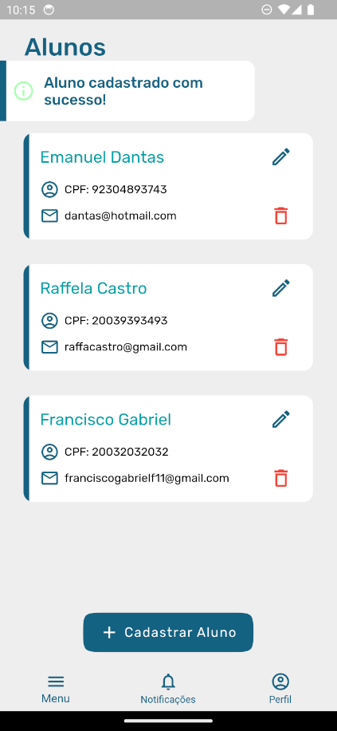
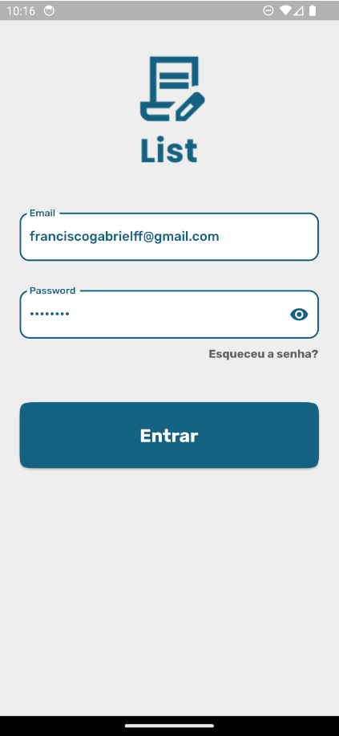

<h2 align="center">Challenge Flutter<h2>
<p align="center">
    
</p>

   <h2>Topics 📋</h2>

  <p>
   
   - [About 📖](#about-)
   - [Preview 📱](#preview-)
   - [Technologies Used 👨🏽‍💻](#---technologies-used----)
   - [How to Use 🤔](#how-to-use-)
   </p>

   <h2>About 📖</h2>
   
   <p>
     Projeto criado para realização do teste de desenvolvimento para a empresa +A Educação. O projeto consiste em um sistema de gereciamento para cadastro de alunos. Nele você pode listar, criar, editar, ou excluir qualquer aluno da base de dados. O sistema tambem conta com login como forma de autenticação.
   </p>

---

   <h2>Preview 📱</h2><br>

   <p a>
    
    
   </p>

---

 <h2>
   Technologies Used 👨🏽‍💻
   </h2>
   
- **another_flushbar** -> Usado para criação e utilização de toasts.
- **bloc** -> Gerenciador de estado.
- **dio** -> Pacote de rede para efetuar requisições http.
- **google_fonts** -> Utilização de fontes nativa do Google.
- **flutter_launcher_icons** -> Customização e configuração do ícone do applicativo.
- **flutter_native_splash** -> Criação da Splash Screen nativa do aplicativo.
- **flutter_staggered_animations** -> Criar animações para listas.
- **flutter_svg** -> Utilização de arquivos ".svg".
- **mask_text_input_formatter** -> Criação de máscaras para campos de texto nos formulários.
- **freezed** -> Gerador de código para classes de estados e eventos do bloc.
  
---

   <h2>How to Use 🤔</h2>

```
- Clone this repository:
$ git clone https://github.com/Franciscof11/Challenge_Flutter Challenge_Flutter

- Enter in directory:
$ cd Challenge_Flutter

- For install dependencies:
$ flutter pub get

- Connect your emulator or physical device

- Run the app:
$ flutter run
```

---

This project was developed by **[@Francisco Gabriel](https://www.linkedin.com/in/franciscossg/)**,
if it helped you, give ⭐, it will help me too 😉.

---

   <div>

[](https://www.linkedin.com/in/franciscossg/)

   </div>

